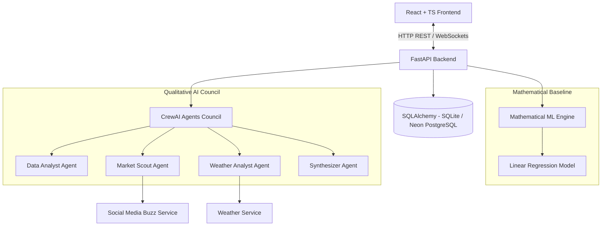

# 📊 ClearShelf: AI-Driven Retail Demand Forecasting System

Welcome to **ClearShelf**, a state-of-the-art retail inventory optimization and demand forecasting platform. ClearShelf blends traditional machine learning with a collaborative, multi-agent AI council powered by **CrewAI** to provide retailers with both mathematical precision and real-world qualitative context.

This document serves as an exhaustive, beginner-friendly guide that explains the system's inner workings, underlying architectures, workflows, current technical limitations (flaws), recent engineering improvements, and future roadmaps. Whether you are a business stakeholder, a beginner developer, or a non-technical enthusiast, this guide will walk you through the system.

---

## 🌟 The Core Concept: Combining Math and Mind

In traditional retail, predicting how many units of a product (e.g., winter jackets, hiking boots, or umbrellas) will sell tomorrow is a major challenge:
*   **Under-stocking** leads to empty shelves, disappointed customers, and lost revenue.
*   **Over-stocking** ties up valuable capital in unsold inventory and increases storage costs.

### Why Traditional Math Falls Short
Traditional forecasting relies on historical sales data. A mathematical model looks at the last 30 days of sales, identifies a trend (e.g., sales are going up by 2% daily), checks for weekday seasonality (e.g., weekends sell more than weekdays), and projects tomorrow's number. 

However, mathematical models are **blind to the real world**. They don't know that:
*   ☔ Tomorrow's forecast predicts a major rainstorm.
*   🔥 A viral social media campaign just launched.
*   📉 A competitor lowered their prices.

### The ClearShelf Solution: Hybrid Forecasting
ClearShelf solves this by combining two distinct layers:
1.  **The Mathematical Baseline**: Uses machine learning (`scikit-learn`'s Linear Regression) to fit a rolling demand curve based on historical transactions.
2.  **The Qualitative AI Council**: Coordinates a team of specialized AI agents (`CrewAI`) to ingest external data streams (like weather reports and social media sentiment) and calculate a percentage adjustment to apply to the mathematical baseline.

---

## 🏗️ High-Level System Architecture

ClearShelf is designed as a service-oriented web application consisting of a modern, glassmorphic React frontend, an asynchronous FastAPI backend, a relational database, and an LLM-powered multi-agent layer.



### The Architectural Components:
*   **Frontend (Vite + React + TS)**: A premium, highly interactive dashboard that lets users manage products, track warehouse storage, monitor suppliers, upload CSV records, and trigger forecasts. It utilizes WebSockets to stream the step-by-step thinking logs of the AI agents in real-time.
*   **Backend (FastAPI)**: A high-performance Python framework that exposes RESTful endpoints for inventory management and handles the orchestration of mathematical and agentic pipelines.
*   **Database (SQLAlchemy + SQLite/PostgreSQL)**: A relational storage layer that holds information about products, historical transactions, generated forecasts, and upload history.
*   **Agentic Layer (CrewAI)**: A multi-agent framework that defines roles, backstories, and tasks for AI agents, prompting them to collaborate sequentially to reach a final forecast consensus.

---

## 🔄 End-to-End System Workflow

The workflow of the system is divided into three distinct phases: **Ingestion**, **Forecasting**, and **WebSocket Streaming**.

```mermaid
sequenceDiagram
    autonumber
    actor User as Store Manager
    participant FE as React Frontend
    participant BE as FastAPI Backend
    participant DB as Relational Database
    participant ML as ML Engine (Linear Regression)
    participant Crew as CrewAI Agent Council

    User->>FE: Uploads Transaction CSV
    FE->>BE: POST /api/upload/import (File bytes)
    BE->>BE: Compute SHA-256 Hash of raw file
    BE->>DB: Check if Hash already exists (Deduplication)
    alt Hash is Duplicate
        BE-->>FE: Return 400 Bad Request (Error Alert)
    else Hash is Unique
        BE->>BE: Pandas EDA: Align columns & clean nulls
        BE->>DB: Bulk insert transactions & products
        BE-->>FE: Return 200 OK (Import Success)
    end

    User->>FE: Selects product & clicks "Trigger Forecast"
    FE->>BE: POST /api/forecast/trigger (Product ID, AI Enabled)
    BE->>DB: Retrieve 30-day sales history
    alt History < 30 days
        BE->>BE: Auto-pad database with historical seasonality & random noise
    end
    BE->>ML: Fit Linear Regression on 30-day sales history
    ML->>BE: Return Baseline ML Prediction (e.g., 50 units)
    
    rect rgb(20, 20, 30)
        Note over BE, Crew: AI Council Deliberation (If enabled)
        BE->>Crew: Launch sequential CrewAI run
        loop Live Log Streaming
            Crew->>BE: Capture sys.stdout print statements
            BE-->>FE: Stream agent reasoning logs via WebSockets (ws://)
            FE->>User: Display logs in real-time terminal console
        end
        Crew->>BE: Return Consensus Synthesis (Markdown Report + Adjusted Qty)
    end

    BE->>DB: Save baseline and adjusted quantities in forecasts table
    BE-->>FE: Return 200 OK (Forecast Results)
    FE->>User: Update Dashboard Charts & Forecast History
```



---

## 🕵️‍♂️ Deep-Dive: The AI Council Agents

When a user triggers an AI-enriched forecast, the backend coordinates a panel of four virtual specialists using **CrewAI**. Each agent is assigned a unique role, goal, and backstory:

### 1. 📈 The Data Analyst
*   **Role**: Senior Database Analyst & Trend Detector.
*   **Goal**: Analyze 30-day historical transaction records to identify statistical indicators.
*   **Behavior**: Evaluates sales trajectories, calculates the average baseline demand, and runs a seasonality check to calculate how much sales rise during weekends (Friday through Sunday) compared to weekdays.

### 2. 📣 The Market Scout
*   **Role**: Brand Sentiment & Social Trend Analyst.
*   **Goal**: Monitor current promotional campaigns and consumer sentiment.
*   **Behavior**: Evaluates social media activity (weekly mentions, buzz scores, active promotional campaigns). If a promotion is running or sentiment is highly positive, the scout recommends a positive demand adjustment.

### 3. 🌤️ The Weather Analyst
*   **Role**: Meteorological Impact Assessor.
*   **Goal**: Correlate tomorrow's weather predictions with category-specific consumer habits.
*   **Behavior**: Ingests meteorological indicators (temperature, condition, precipitation probability). If a rainstorm is coming and the product is winter boots or jackets, it recommends a positive adjustment; if the weather is warm and dry, it reduces jacket projections.

### 4. 🎓 The Synthesizer (The Consensus Builder)
*   **Role**: Inventory Strategy Director.
*   **Goal**: Reconcile mathematical baseline forecasts with qualitative agent recommendations.
*   **Behavior**: Reviews the reports generated by the Data Analyst, Market Scout, and Weather Analyst. It calculates the final percentage adjustment, combines it with the ML baseline, and generates a formatted Markdown synthesis report detailing the rationale.

---

## 🛠️ High-Fidelity Simulation Mode (Demo Mode)

To allow developers and users to explore the platform without incurring OpenAI or Groq API costs, ClearShelf features a built-in **High-Fidelity Simulation Mode**.
*   **How it works**: If the system detects that no valid `OPENAI_API_KEY` or `GROQ_API_KEY` is configured in the `.env` file, the backend falls back to `run_simulated_crew` inside [crew.py](file:///c:/Users/Aditya/Desktop/ClearStuf/backend/app/agents/crew.py).
*   **Determinism**: It uses the hash of the target SKU and date strings to seed the random number generators, ensuring that the simulated reports, weather states, and social media scores remain deterministic for a given product on a given day.
*   **Visual Fidelity**: The simulator introduces artificial delays (`time.sleep`) to mimic the real-time reasoning and communication lag of actual LLM processes, streaming realistic step-by-step logic logs over the WebSockets connection to the frontend.

---

## ⚠️ System Flaws and Technical Limitations

While ClearShelf provides a robust demonstration of hybrid forecasting, a real-world enterprise deployment requires addressing several architectural and algorithmic limitations:

### 1. Algorithmic Simplicity of the Baseline
*   **The Issue**: The core mathematical engine uses a standard **Linear Regression** model.
*   **Why it's a flaw**: Linear Regression assumes a straight-line relationship over time. While it captures general upward/downward trajectories and simple weekday seasonality, it fails to model complex, non-linear forecasting patterns such as cyclic monthly/annual seasonality, holiday demand spikes (e.g., Black Friday), promotional decay curves, or multi-collinearity.
*   **Impact**: Projections for highly volatile products can over- or under-estimate baseline sales.

### 2. Simulated External Context
*   **The Issue**: The weather forecasting service ([weather_service.py](file:///c:/Users/Aditya/Desktop/ClearStuf/backend/app/services/weather_service.py)) and social media buzz service ([social_media_service.py](file:///c:/Users/Aditya/Desktop/ClearStuf/backend/app/services/social_media_service.py)) return mocked data.
*   **Why it's a flaw**: The weather and social sentiment data are generated locally using pseudo-random variables seeded by the date and SKU. The system is not connected to a live weather radar API or an actual social scraper.
*   **Impact**: The system cannot respond to sudden, real-world unexpected weather events or genuine social media viral outbreaks unless the mock data is manually updated or replaced with actual API connectors.

### 3. Synchronous LLM Execution & Thread Blocking
*   **The Issue**: CrewAI's task execution loop is synchronous and blocking.
*   **Why it's a flaw**: In Python, standard LLM requests wait for the API response. In [forecast.py](file:///c:/Users/Aditya/Desktop/ClearStuf/backend/app/api/forecast.py), the `trigger_forecast` endpoint handles this by executing the service in a thread pool using Starlette/FastAPI's dependency injections, which prevents blocking the main event loop. However, under high concurrent request volume (e.g., hundreds of managers querying different products simultaneously), the thread pool can saturate, leading to API latency and resource exhaustion.
*   **Impact**: Scalability is constrained; a dedicated message queue (like Celery with Redis/RabbitMQ) is needed for asynchronous task management.

### 4. Training-From-Scratch Overhead
*   **The Issue**: The ML model is re-trained from scratch on every single request.
*   **Why it's a flaw**: Instead of loading a pre-trained model file (like a serialized `.pkl` file) or performing incremental training, the service queries the database, extracts the last 30 transaction rows, and fits the Scikit-Learn regressor on-the-fly.
*   **Impact**: This increases database read overhead and processing latency for each forecasting request.

### 5. Lack of Distributed Logistics (Single Location)
*   **The Issue**: The system tracks inventory as a unified stock quantity.
*   **Why it's a flaw**: Real-world retailers operate multi-branch networks with separate warehouses, regional distribution centers, and physical storefronts. ClearShelf stores a single `current_stock` value in the `products` table and does not support regional transfer logic or multi-location demand distribution.
*   **Impact**: Inventory cannot be optimized across multiple geographical nodes.

---

## 🛠️ Implemented Engineering Solutions

During development, several key improvements were implemented to enhance stability, user experience, and data safety:

*   **SHA-256 Cryptographic File Deduplication**: 
    To prevent duplicate transactional uploads (which would corrupt the rolling history and bias the ML models), the backend computes the SHA-256 hash of the uploaded CSV bytes in [upload.py](file:///c:/Users/Aditya/Desktop/ClearStuf/backend/app/api/upload.py#L110). If the hash is found in `upload_history`, the backend terminates the write and alerts the user, ensuring data integrity.
*   **Thread-Safe WebSocket Log Interception**: 
    To capture the standard output from CrewAI and stream it to the frontend over WebSockets, the system implements a custom `WebSocketStream` wrapper that overrides `sys.stdout` during active runs. It calls `main_loop.call_soon_threadsafe(...)` in [forecast_service.py](file:///c:/Users/Aditya/Desktop/ClearStuf/backend/app/services/forecast_service.py#L23) to broadcast logs safely across thread boundaries back to the main event loop.
*   **Automatic 30-Day Database Seeding**:
    Forecasting models require a baseline history. If a user creates a new product that lacks transactional data, the database's `ensure_30_days_history` service automatically runs back in time to seed 30 days of mock sales, complete with weekend multipliers and uniform random noise, ensuring the system can forecast immediately.
*   **Smart Column Schema Alignment**:
    The CSV ingestion engine is equipped with flexible naming checks. Using Pandas, it maps variations of column headers (such as `mrp`, `unit_price`, or `price` mapping to `price`) automatically, preventing import failures due to simple formatting mismatches.

---

## 🚀 The Future Roadmap: Scaling ClearShelf

To transition ClearShelf from a high-fidelity prototype to an enterprise-grade SaaS platform, the following upgrades are planned:

### 1. Time-Series Upgrades (Advanced Forecasting)
Replace standard Linear Regression with state-of-the-art forecasting models:
*   **Prophet (by Meta)**: Excellent for handling daily, weekly, and yearly seasonalities, holiday effects, and structural trend shifts.
*   **DeepAR / LSTM (Long Short-Term Memory)**: Neural networks designed to capture sequential dependencies and non-linear patterns over time.

### 2. Real-World Integration Connectors
Connect services to live external REST APIs:
*   **OpenWeatherMap API**: Pull live 5-day weather forecasts for the store's physical zip code.
*   **Social Scrapers**: Query Reddit APIs and Twitter/X keyword tracking endpoints to calculate genuine sentiment indices.
*   **E-Commerce Sync**: Synchronize stock counts directly with Shopify or WooCommerce webhooks.

### 3. Automated Purchase Order (PO) Dispatching
Bridge forecasting with supplier logic:
*   When the system calculates that `current_stock` will fall below the `total_7day_forecast` quantity, it automatically generates a pending Purchase Order (PO) in the database.
*   The PO is calculated based on the supplier's average lead time and automatically dispatched to the supplier's contact email.

### 4. Distributed Task Queuing
*   Introduce **Celery** with **Redis** to offload forecasting jobs.
*   When a user clicks "Trigger Forecast", FastAPI will push the job to Redis and return a task ID. The dashboard will monitor the progress of the worker task asynchronously, eliminating the risk of thread-blocking.

---

## 💻 Technical Setup and Local Execution

Follow these steps to run ClearShelf on your local machine:

### Prerequisites:
*   **Python 3.10+**
*   **Node.js v18+**
*   **PostgreSQL** (Optional; local SQLite is used by default if no connection string is provided)

---

### Step 1: Backend Configuration

1.  Navigate into the `backend/` directory:
    ```bash
    cd backend
    ```
2.  Create and activate a virtual environment:
    *   **Windows**:
        ```powershell
        python -m venv venv
        .\venv\Scripts\activate
        ```
    *   **macOS / Linux**:
        ```bash
        python3 -m venv venv
        source venv/bin/activate
        ```
3.  Install dependencies:
    ```bash
    pip install -r requirements.txt
    ```
4.  Configure environment variables in a `.env` file:
    ```env
    DATABASE_URL=your-optional-postgresql-url
    OPENAI_API_KEY=your-openai-api-key # Optional: Leave blank to use simulator mode
    OPENAI_MODEL_NAME=gpt-4o
    GROQ_API_KEY=your-groq-api-key # Optional: Alternative LLM
    GROQ_MODEL_NAME=llama-3.1-70b-versatile
    ```
5.  Start the backend development server:
    ```bash
    uvicorn app.main:app --reload
    ```
    *The database will be automatically initialized and seeded with mock inventory and sales records. The API documentation will be available at `http://localhost:8000/docs`.*

---

### Step 2: Frontend Configuration

1.  Navigate into the `frontend/` directory:
    ```bash
    cd ../frontend
    ```
2.  Install the required Node packages:
    ```bash
    npm install
    ```
3.  Start the Vite development server:
    ```bash
    npm run dev
    ```
    *The web application will launch at `http://localhost:5173`.*

---

### Step 3: Run Helper Scripts (Windows Only)
You can start both systems quickly using the root scripts:
*   Double-click `run_backend.bat` or execute `.\run_backend.ps1` in PowerShell to launch the API server.
*   Navigate to the frontend and run `npm run dev` to start the interface.
