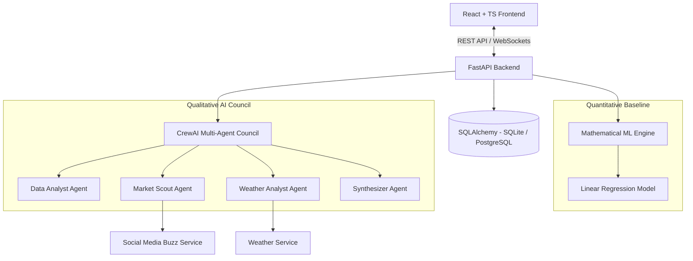

# 🛍️ Comprehensive Review & Enhancement Strategy: Retail Demand Forecasting in ClearShelf

## 📌 Executive Summary

**ClearShelf** is an innovative retail demand forecasting and inventory management platform that bridges the gap between quantitative statistical modeling and qualitative real-world context. By pairing a Scikit-Learn machine learning baseline with a collaborative **CrewAI Multi-Agent Council**, ClearShelf addresses a critical limitation of traditional forecasting systems: their inability to account for qualitative real-world events such as weather shifts and social media sentiment.

This report provides an exhaustive **codebase review**, evaluates the platform from a **real-world user and business perspective**, identifies current architectural and algorithmic bottlenecks, and outlines a practical roadmap for transforming ClearShelf into an enterprise-grade retail intelligence platform.

---

## 1. 🏗️ Review of Existing System & Features

ClearShelf currently implements a end-to-end forecasting pipeline backed by a FastAPI microservice and a Vite + React modern frontend dashboard.



### Key Strengths & Existing Capabilities

1. **Hybrid Forecasting Architecture**:
   - Combines a quantitative baseline generated by [linear_regression.py](file:///c:/Users/Aditya/Desktop/ClearStuf/backend/app/models/linear_regression.py) with qualitative adjustments produced by the CrewAI agent council in [crew.py](file:///c:/Users/Aditya/Desktop/ClearStuf/backend/app/agents/crew.py).
   - Generates both a mathematical base quantity and an AI-adjusted demand projection accompanied by an explanatory Markdown report.

2. **Real-time Log Streaming via WebSockets**:
   - Uses a custom thread-safe stream interceptor (`WebSocketStream`) in [forecast_service.py](file:///c:/Users/Aditya/Desktop/ClearStuf/backend/app/services/forecast_service.py#L14-L27) and [websocket.py](file:///c:/Users/Aditya/Desktop/ClearStuf/backend/app/api/websocket.py) to stream AI agent thought processes directly to the user's browser in real-time.

3. **Data Integrity & Robust CSV Ingestion**:
   - Implements **SHA-256 cryptographic deduplication** in [upload.py](file:///c:/Users/Aditya/Desktop/ClearStuf/backend/app/api/upload.py#L110) to prevent duplicate transaction loads.
   - Includes automatic column schema alignment and automatic 30-day historical data padding in [forecast_service.py](file:///c:/Users/Aditya/Desktop/ClearStuf/backend/app/services/forecast_service.py#L31-L75).

4. **High-Fidelity Offline Simulation Mode**:
   - When no external LLM API key (`OPENAI_API_KEY` / `GROQ_API_KEY`) is present, the backend falls back to deterministic simulated agent runs, ensuring full UI functionality without incurring API costs.

5. **Integrated Retail Operations UI**:
   - Manages Products, Historical Transactions, Suppliers, Purchase Orders (PO status tracking), and Warehouses.

---

## 2. 🔍 Deep-Dive Codebase Review & Technical Limitations

While ClearShelf provides a solid proof-of-concept, a close inspection of the codebase reveals several technical and structural limitations that impact its real-world accuracy and enterprise scalability:

### 2.1. Algorithmic Limitations of the ML Engine
- **Single-Day Horizon**: The model in [linear_regression.py](file:///c:/Users/Aditya/Desktop/ClearStuf/backend/app/models/linear_regression.py#L36-L41) only forecasts demand for $t+1$ (tomorrow). Real-world supply chains operate on replenishment lead times spanning days or weeks (e.g., 7-day, 14-day, or 30-day windows).
- **Linear Model Constraints**: Standard Ordinary Least Squares (OLS) Linear Regression struggles with non-linear sales trajectories, complex annual seasonality, price elasticity, and promotional spikes.
- **On-the-Fly Training**: The model is fit from scratch on every incoming request rather than utilizing a pre-trained model registry or incremental training pipeline.

### 2.2. Data Model & Granularity Constraints
- **Single-Location Assumption**: In [models.py](file:///c:/Users/Aditya/Desktop/ClearStuf/backend/app/database/models.py#L12-L24), stock is recorded as a single aggregate integer (`current_stock`). Real retail operations manage inventory across multiple store locations, regional fulfillment centers, and online channels.
- **Lack of Price & Promo History**: Transactions in `historical_sales` only capture `date` and `quantity`, omitting unit selling price, promotional flags, discount percentages, or stockout markers.

### 2.3. Simulated External Context
- Both [weather_service.py](file:///c:/Users/Aditya/Desktop/ClearStuf/backend/app/services/weather_service.py) and [social_media_service.py](file:///c:/Users/Aditya/Desktop/ClearStuf/backend/app/services/social_media_service.py) produce mock data generated locally with pseudo-random variables seeded by SKU and date. They are not connected to live external APIs.

---

## 3. 🎯 Real-World User & Business Perspective Analysis

To make ClearShelf genuinely valuable to store managers, inventory planners, buyers, and supply chain executives, the system must address the actual daily workflow and pain points of retail operations:

```
               TRADITIONAL FORECAST                    REAL-WORLD RETAIL NEED
     +---------------------------------------+ +---------------------------------------+
     | "Tomorrow's forecast is 45 units."    | | "Forecast next 14 days = 620 units.  |
     |                                       | |  Current Stock = 180 units.          |
     |  (User thinks: So what do I do next?) | |  Lead Time = 5 days.                 |
     |                                       | |  Safety Stock = 90 units.            |
     |                                       | |  ==> Action: Order 530 units NOW."   |
     +---------------------------------------+ +---------------------------------------+
```

### The 5 Core Needs of Retail Users:

1. **Actionable Operational Outputs (Not Just Raw Numbers)**:
   - A retailer doesn't just want to know "how many will sell tomorrow." They need to know: *"When will I run out of stock?", "How much should I order today?", and "Which supplier should I place the Purchase Order with?"*
2. **Multi-Period Rolling Horizon (7-Day, 14-Day, 30-Day)**:
   - Suppliers require lead time to manufacture and ship goods. Forecasting must cover the full lead-time window plus review period.
3. **Safety Stock & Reorder Point Calculations**:
   - Demand and lead times fluctuate. System must calculate dynamic **Safety Stock (SS)** to prevent costly stockouts during demand surges:
     $$SS = Z \times \sqrt{L \cdot \sigma_D^2 + D^2 \cdot \sigma_{LT}^2}$$
     $$\text{Reorder Point (ROP)} = (d \times L) + SS$$
     *(where $d$ = average daily demand, $L$ = lead time in days, $Z$ = service factor e.g. 1.65 for 95% service level, $\sigma_D$ = demand standard deviation, $\sigma_{LT}$ = lead time standard deviation)*.
4. **Forecast Accuracy & Financial Impact Metrics**:
   - Business leaders require tracking metrics such as **WAPE** (Weighted Absolute Percentage Error), **MAPE**, **Tracking Signal** (detecting bias), and estimated financial impact ($ risk of stockout vs $ holding cost of overstock).
5. **Handling Complex Retail Patterns**:
   - **Promotions & Discounts**: Price elasticity modeling.
   - **Intermittent / Slow-Moving Items**: Items that sell zero units on 80% of days require specialized models (e.g., Croston's Method or SBA) rather than standard regression.
   - **Cold Start (New Products)**: Attribute-based matching using LLMs or past similar SKU histories.

---

## 4. 🚀 Recommended Enhancements & Implementation Roadmap

We propose a phased strategy to transform ClearShelf into a comprehensive, user-centric retail forecasting platform.

### Phase 1: Immediate High-Impact Enhancements (Short-Term)

#### A. Multi-Period Rolling Horizon Forecast Engine
Extend [linear_regression.py](file:///c:/Users/Aditya/Desktop/ClearStuf/backend/app/models/linear_regression.py) and [forecast_service.py](file:///c:/Users/Aditya/Desktop/ClearStuf/backend/app/services/forecast_service.py) to support 7-day, 14-day, and 30-day forecast projections alongside the single-day prediction.

#### B. Dynamic Safety Stock & Reorder Point Calculation
Integrate lead time from `products.lead_time_days` and historical demand variance to calculate:
- Dynamic Safety Stock ($SS$)
- Automated Reorder Point ($ROP$)
- Days of Supply Remaining ($DOS = \frac{\text{Current Stock}}{\text{Avg Daily Forecast}}$)
- Stockout Risk Indicator (Low, Medium, High, Critical)

#### C. Automated Purchase Order Recommendation Workflow
When `current_stock <= Reorder Point`, the system automatically drafts a recommended Purchase Order in `purchase_orders` linked to the product's assigned supplier, specifying the exact recommended order quantity ($EOQ$ or Target Stock Level - Current Stock).

#### D. Retail KPI Dashboard (Accuracy & Financial Metrics)
Introduce forecast accuracy tracking:
- **WAPE (Weighted Absolute Percentage Error)**:
  $$\text{WAPE} = \frac{\sum |Actual_t - Forecast_t|}{\sum Actual_t} \times 100\%$$
- **Tracking Signal** to detect systemic over-forecasting or under-forecasting.
- **Estimated Stockout Risk ($)** and **Carrying Cost ($)** metrics.

---

### Phase 2: Advanced Data & Model Upgrades (Mid-Term)

#### A. Upgraded Machine Learning Models
Replace/augment Linear Regression with modern time-series models:
- **LightGBM / XGBoost Regressor**: Feature-engineered with lag variables ($t-1, t-7, t-14, t-30$), rolling averages, day-of-week, day-of-month, and promotional flags.
- **Prophet (Meta)**: Excellent for strong seasonalities (weekly, monthly, annual) and holiday holiday matrices.
- **Croston's Method / SBA**: For intermittent / slow-moving long-tail products.

#### B. Real-World External API Connectors
- **Weather Connector**: Integrate live 5-day weather data via OpenWeatherMap API using store ZIP/postal codes.
- **Social & Trend Connector**: Integrate Google Trends API (via `pytrends`) or Twitter/Reddit sentiment endpoints.
- **POS / E-Commerce Sync**: Add webhooks or connectors for Shopify, WooCommerce, or Square.

#### C. Hierarchical & Multi-Location Forecasting
Update database schema to support Multi-Warehouse / Multi-Store forecasting:
- `locations` table (Store A, Store B, Warehouse East).
- `inventory_by_location` table.
- Top-Down / Bottom-Up reconciliation to balance store-level forecasts with regional warehouse replenishment.

---

### Phase 3: Enterprise & SaaS Features (Long-Term)

#### A. Interactive "What-If" Scenario Simulator
Allow store managers to simulate business scenarios before taking action:
- *"What if we run a 20% discount promotion next weekend?"*
- *"What if supplier lead time increases from 5 to 12 days due to shipping delays?"*
- *"What if a heatwave strikes next week?"*

#### B. Asynchronous Job Processing with Celery & Redis
Offload heavy forecast computations and CrewAI agent executions to background worker queues (`Celery` + `Redis`), ensuring sub-second HTTP response times for API consumers.

#### C. Enterprise Access Control & Audit Logging
Add Role-Based Access Control (RBAC) for Store Managers, Regional Directors, and Warehouse Operators, complete with audit trail tracking for all inventory adjustments.

---

## 5. 📊 Feature Comparison & Value Matrix

| Feature | Current State | Proposed Enhancement | Business Value to User |
| :--- | :--- | :--- | :--- |
| **Forecast Horizon** | 1-day prediction | 7-day, 14-day, 30-day rolling forecast | Enables replenishment planning over supplier lead times |
| **Inventory Actions** | View stock level | Dynamic Safety Stock, Reorder Point, Auto-PO Drafts | Prevents stockouts & automates reordering |
| **ML Model** | Linear Regression | LightGBM / Prophet / Croston's Method | Higher forecast accuracy across all SKU velocity types |
| **External Context** | Mocked local service | Real APIs (OpenWeatherMap, Google Trends) | Real-time responsiveness to actual weather/market events |
| **Locations** | Single aggregate stock | Multi-Store / Multi-Warehouse hierarchy | Optimizes stock allocation across regional networks |
| **Accuracy Tracking**| None | WAPE, MAPE, Tracking Signal, $ Risk | Financial visibility & model performance auditing |
| **Scenario Testing** | Static prompt | Interactive "What-If" Promo & Lead-Time Simulator | Empowers data-driven marketing & supply chain decisions |

---

## 📌 Conclusion & Recommended Next Steps

ClearShelf has established a strong foundation by pioneering a hybrid **Math + AI Agent** approach to retail forecasting. By evolving from single-day predictions to multi-period rolling forecasts, incorporating dynamic Safety Stock and automated Purchase Order generation, and integrating real-world API connectors, ClearShelf will deliver immense practical value to retail stakeholders.

**Recommended Immediate Next Step**: Implement the **Multi-Period Horizon Engine** and **Dynamic Safety Stock / Auto-PO Recommendation Engine** to make the system instantly actionable for store managers.
