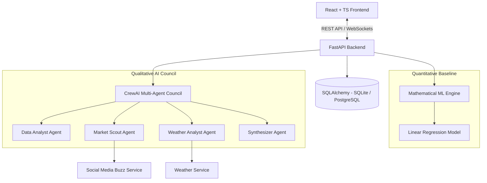
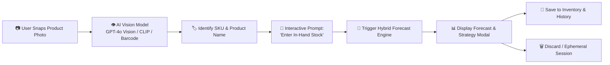

# 🛍️ Comprehensive Review & Enhancement Strategy: Retail Demand Forecasting in ClearShelf

## 📌 Executive Summary

**ClearShelf** is an innovative retail demand forecasting and inventory management platform that bridges the gap between quantitative statistical modeling and qualitative real-world context. By pairing a Scikit-Learn machine learning baseline with a collaborative **CrewAI Multi-Agent Council**, ClearShelf addresses a critical limitation of traditional forecasting systems: their inability to account for qualitative real-world events such as weather shifts and social media sentiment.

This report provides an exhaustive **codebase review**, evaluates the platform from a **real-world user and business perspective**, identifies current architectural bottlenecks, and incorporates key user-driven innovations—including **10,000+ Product Bulk Ingestion Optimization**, a **Snap-to-Forecast AI Visual Camera Scanner**, and an **Advanced ML Model Taxonomy**.

---

## 1. 🏗️ Review of Existing System & Features

ClearShelf currently implements an end-to-end forecasting pipeline backed by a FastAPI microservice and a Vite + React modern frontend dashboard.



### Key Strengths & Existing Capabilities

1. **Hybrid Forecasting Architecture**:
   - Combines a quantitative baseline generated by [linear_regression.py](file:///c:/Users/Aditya/Desktop/ClearStuf/backend/app/models/linear_regression.py) with qualitative adjustments produced by the CrewAI agent council in [crew.py](file:///c:/Users/Aditya/Desktop/ClearStuf/backend/app/agents/crew.py).
   - Generates both a mathematical base quantity and an AI-adjusted demand projection accompanied by an explanatory Markdown report.

2. **Real-time Log Streaming via WebSockets**:
   - Uses a custom thread-safe stream interceptor (`WebSocketStream`) in [forecast_service.py](file:///c:/Users/Aditya/Desktop/ClearStuf/backend/app/services/forecast_service.py#L14-L27) and [websocket.py](file:///c:/Users/Aditya/Desktop/ClearStuf/backend/app/api/websocket.py) to stream AI agent thought processes directly to the user's browser in real-time.

3. **Data Integrity & Robust CSV Ingestion**:
   - Implements **SHA-256 cryptographic deduplication** in [upload.py](file:///c:/Users/Aditya/Desktop/ClearStuf/backend/app/api/upload.py#L110) to prevent duplicate transaction loads.
   - Includes automatic column schema alignment and automatic 30-day historical data padding in [forecast_service.py](file:///c:/Users/Aditya/Desktop/ClearStuf/backend/app/services/forecast_service.py#L31-L75).

4. **High-Fidelity Offline Simulation Mode**:
   - When no external LLM API key (`OPENAI_API_KEY` / `GROQ_API_KEY`) is present, the backend falls back to deterministic simulated agent runs, ensuring full UI functionality without incurring API costs.

5. **Integrated Retail Operations UI**:
   - Manages Products, Historical Transactions, Suppliers, Purchase Orders (PO status tracking), and Warehouses.

---

## 2. 🔍 Deep-Dive Codebase Review & Technical Limitations

While ClearShelf provides a solid proof-of-concept, a close inspection of the codebase reveals several technical and structural limitations that impact its real-world accuracy and enterprise scalability:

### 2.1. Algorithmic Limitations of the ML Engine
- **Single-Day Horizon**: The model in [linear_regression.py](file:///c:/Users/Aditya/Desktop/ClearStuf/backend/app/models/linear_regression.py#L36-L41) only forecasts demand for $t+1$ (tomorrow). Real-world supply chains operate on replenishment lead times spanning days or weeks (e.g., 7-day, 14-day, or 30-day windows).
- **Linear Model Constraints**: Standard Ordinary Least Squares (OLS) Linear Regression struggles with non-linear sales trajectories, complex annual seasonality, price elasticity, and promotional spikes.
- **On-the-Fly Training**: The model is fit from scratch on every incoming request rather than utilizing a pre-trained model registry or incremental training pipeline.

### 2.2. Data Model & Scalability Bottlenecks
- **Synchronous CSV Ingestion Bottleneck**: The current CSV upload pipeline in [upload.py](file:///c:/Users/Aditya/Desktop/ClearStuf/backend/app/api/upload.py) parses and inserts records synchronously. For large enterprise datasets containing **10,000+ products across multiple categories**, this blocks the main server thread, risks HTTP request timeouts, and freezes the UI.
- **Single-Location Assumption**: In [models.py](file:///c:/Users/Aditya/Desktop/ClearStuf/backend/app/database/models.py#L12-L24), stock is recorded as a single aggregate integer (`current_stock`). Real retail operations manage inventory across multiple store locations, regional fulfillment centers, and online channels.
- **Lack of Price & Promo History**: Transactions in `historical_sales` only capture `date` and `quantity`, omitting unit selling price, promotional flags, discount percentages, or stockout markers.

### 2.3. Simulated External Context
- Both [weather_service.py](file:///c:/Users/Aditya/Desktop/ClearStuf/backend/app/services/weather_service.py) and [social_media_service.py](file:///c:/Users/Aditya/Desktop/ClearStuf/backend/app/services/social_media_service.py) produce mock data generated locally with pseudo-random variables seeded by SKU and date. They are not connected to live external APIs.

---

## 3. 🎯 Real-World User & Business Perspective Analysis

To make ClearShelf genuinely valuable to store managers, inventory planners, buyers, and supply chain executives, the system must address actual daily retail workflows:

```
               TRADITIONAL FORECAST                    REAL-WORLD RETAIL NEED
     +---------------------------------------+ +---------------------------------------+
     | "Tomorrow's forecast is 45 units."    | | "Forecast next 14 days = 620 units.  |
     |                                       | |  Current Stock = 180 units.          |
     |  (User thinks: So what do I do next?) | |  Lead Time = 5 days.                 |
     |                                       | |  Safety Stock = 90 units.            |
     |                                       | |  ==> Action: Order 530 units NOW."   |
     +---------------------------------------+ +---------------------------------------+
```

### The Core Needs of Retail Users:

1. **Actionable Operational Outputs (Not Just Raw Numbers)**:
   - Retailers need to know: *"When will I run out of stock?", "How much should I order today?", and "Which supplier should I place the Purchase Order with?"*
2. **Multi-Period Rolling Horizon (7-Day, 14-Day, 30-Day)**:
   - Suppliers require lead time to manufacture and ship goods. Forecasting must cover the full lead-time window plus review period.
3. **Safety Stock & Reorder Point Calculations**:
   - Demand and lead times fluctuate. System must calculate dynamic **Safety Stock (SS)** to prevent costly stockouts during demand surges:
     $$SS = Z \times \sqrt{L \cdot \sigma_D^2 + D^2 \cdot \sigma_{LT}^2}$$
     $$\text{Reorder Point (ROP)} = (d \times L) + SS$$
     *(where $d$ = average daily demand, $L$ = lead time in days, $Z$ = service factor e.g. 1.65 for 95% service level, $\sigma_D$ = demand standard deviation, $\sigma_{LT}$ = lead time standard deviation)*.
4. **Forecast Accuracy & Financial Impact Metrics**:
   - Business leaders require tracking metrics such as **WAPE** (Weighted Absolute Percentage Error), **MAPE**, **Tracking Signal** (detecting bias), and estimated financial impact ($ risk of stockout vs $ holding cost of overstock).

---

## 4. 🚀 High-Impact User-Centric Feature Enhancements

### 4.1. ⚡ Enterprise Bulk CSV Ingestion Engine (10,000+ Products)

When handling large datasets with **10,000+ SKUs across diverse categories**, synchronous CSV processing is unacceptable. The system must be upgraded to an asynchronous batch pipeline:

```mermaid
sequenceDiagram
    autonumber
    actor User as Retail Manager
    participant FE as React Frontend
    participant BE as FastAPI Backend
    participant WS as WebSocket Progress Streamer
    participant DB as Database (PostgreSQL / SQLite)

    User->>FE: Uploads Large CSV (10,000+ SKUs)
    FE->>BE: POST /api/upload/bulk-async
    BE->>BE: SHA-256 Deduplication Check
    BE-->>FE: Returns 202 Accepted (Job ID: bulk_8921)
    
    rect rgb(25, 25, 35)
        Note over BE, DB: Asynchronous Background Chunked Processing
        loop For each chunk of 1,000 records
            BE->>BE: Pandas vectorized clean & Category partitioning
            BE->>DB: Bulk insert mappings (executemany / COPY)
            BE->>WS: Broadcast percent complete (e.g. 70% - 7,000/10,000)
            WS-->>FE: Update real-time progress bar on UI
        end
    end
    
    WS-->>FE: Broadcast Batch Completion Event
    FE->>User: Show Success Alert & Instant Inventory Category Filter
```



#### Technical Implementation Details:
- **Asynchronous Chunking**: Parse CSV in chunks using `pandas.read_csv(file, chunksize=1000)`.
- **Database Bulk Copy**: Utilize SQLAlchemy `db.bulk_insert_mappings()` or PostgreSQL native `COPY` command to achieve 50x faster insertion speeds.
- **Category Indexing**: Automatically index products by `category_id` to enable instant filtering and category-level demand aggregation.
- **Live Progress Bar**: Stream ingestion status (`{ "processed": 7500, "total": 10000, "percentage": 75.0 }`) over WebSockets.

---

### 4.2. 📸 "Snap-to-Forecast" AI Visual Stock Scanner (Computer Vision Integration)

To eliminate manual data entry for store clerks and inventory managers, ClearShelf will feature a **Mobile/Web Camera AI Scanner** allowing users to snap a picture of a physical product on the shelf and receive an instant demand forecast.



#### User Workflow & Interaction Design:
1. **Camera Capture**: User taps **"Snap Product"** in the mobile/web UI to activate the camera or scan a barcode/packaging image.
2. **Visual Product Detection**:
   - The image payload is passed to a Multi-Modal Vision Model (e.g., **GPT-4o Vision** or **CLIP vector embedding search** against the product catalog).
   - The model identifies the exact product name, category, and SKU (e.g., *"Winter Fleece Jacket - SKU: WFJ-882"*).
3. **Interactive Stock Confirmation**:
   - The UI displays the recognized product and asks the user:
     > *"Product Identified: Winter Fleece Jacket (SKU: WFJ-882).*  
     > *Please enter your current in-hand stock count: [ 35 ] units."*
4. **Instant Forecast Execution**:
   - User inputs the stock count and taps **"Forecast Now"**. The backend runs the ML baseline + CrewAI agent council.
5. **Flexible Persistence Options**:
   - The UI presents the predicted demand and safety stock recommendation along with two clear action buttons:
     - 💾 **"Save to Inventory & History"**: Updates database product stock, saves forecast record, and triggers PO recommendation if stock is low.
     - 🗑️ **"Discard Forecast"**: Clears the temporary session forecast without cluttering the database.

---

### 4.3. 🧮 Advanced ML Model & Algorithm Taxonomy for Retail

To surpass basic Linear Regression, ClearShelf will incorporate a suite of state-of-the-art machine learning models tailored to different retail demand profiles:

```
                                  RETAIL SKUS FORECASTING TAXONOMY
                                                |
          +-------------------------------------+-------------------------------------+
          |                                     |                                     |
  [FAST-MOVING REGULAR DEMAND]      [SLOW-MOVING / INTERMITTENT DEMAND]      [COLD START / NEW PRODUCTS]
  • LightGBM / XGBoost Regressor    • Croston's Method                       • LLM Attribute Embedding Match
  • Meta Prophet / NeuralProphet    • Syntetos-Boylan Approx (SBA)           • Transfer Learning (Similar SKUs)
  • Temporal Fusion Transformers    • Zero-Inflated Poisson Regressor        • Zero-Shot Chronos Foundation Model
```

#### 1. 🌲 Gradient Boosted Decision Trees (LightGBM / XGBoost / CatBoost)
- **Best For**: High-volume, fast-moving retail SKUs with complex tabular features.
- **Why It's Superior**: Standard winner of the M5 Retail Forecasting Competition. Handles lag features ($t-1, t-7, t-14, t-30$), rolling statistics (mean, std dev), price elasticity (discount %), day-of-week, holidays, and categorical encodings effortlessly.

#### 2. 📈 Meta Prophet & NeuralProphet
- **Best For**: SKUs driven by multi-period seasonality (daily, weekly, annual) and known holiday event calendars (e.g., Black Friday, Cyber Monday, Ramzan/Diwali).
- **Why It's Superior**: Automatically decomposes time-series into trend, weekly seasonality, annual seasonality, and holiday matrices with robust handling of missing values.

#### 3. 🎯 Croston's Method & Syntetos-Boylan Approximation (SBA)
- **Best For**: Intermittent / Slow-Moving long-tail items (e.g., spare parts, luxury goods, low-frequency purchases where 80% of daily sales are 0).
- **Why It's Superior**: Standard regression models fail completely on zero-inflated data by predicting non-sensical fractional averages. Croston's method separately models the **time interval between non-zero demand events** and the **magnitude of demand when an event occurs**.

#### 4. 🧠 DeepAR & Temporal Fusion Transformers (TFT)
- **Best For**: Deep learning probabilistic forecasting across thousands of cross-correlated SKUs.
- **Why It's Superior**: Outputs full probabilistic prediction distributions (P10, P50, P90 confidence intervals), allowing retailers to plan for best-case, expected, and worst-case demand scenarios.

#### 5. ⚡ Amazon Chronos & TimesFM (Time-Series Foundation Models)
- **Best For**: Zero-shot forecasting without extensive historical training.
- **Why It's Superior**: Pre-trained on billions of time-series observations, Chronos tokenizes time-series values like language tokens, enabling accurate forecasting on minimal historical data.

---

## 5. 🚀 Phased Implementation Roadmap

```
Phase 1: High-Impact Operations & Usability (Immediate)
 ├── 10,000+ Product Async Bulk CSV Processing & Live Progress Stream
 ├── "Snap-to-Forecast" AI Camera Scanner (GPT-4o Vision / Barcode)
 ├── Save vs Discard Ephemeral Forecast Options
 └── Multi-Period Horizon (7, 14, 30 days) + Safety Stock Engine

Phase 2: Advanced Model Architecture (Mid-Term)
 ├── LightGBM / XGBoost Feature Pipeline (Lags, Rolling Means, Elasticity)
 ├── Croston's Method for Slow-Moving / Intermittent SKUs
 ├── Real API Connectors (OpenWeatherMap, Google Trends, POS Systems)
 └── Retail KPI Dashboard (WAPE, Tracking Signal, Stockout Risk $)

Phase 3: Enterprise Scale & SaaS Readiness (Long-Term)
 ├── Interactive "What-If" Promo & Lead-Time Simulator
 ├── Asynchronous Task Queue (Celery + Redis + Pre-Trained Model Registry)
 └── Multi-Store / Multi-Warehouse Hierarchical Reconciliation
```

---

## 6. 📊 Feature Comparison & Business Value Matrix

| Feature | Current State | Proposed Enhancement | Business Value to User |
| :--- | :--- | :--- | :--- |
| **Large CSV Upload** | Synchronous line-by-line | Async batch chunking + Live WebSocket progress bar | Handles 10,000+ products instantly without UI freezing |
| **Product Scanning** | Manual dropdown selection | 📷 "Snap-to-Forecast" AI Camera Scanner | Zero-touch inventory auditing for store managers |
| **Forecast Session** | Always saved to DB | Interactive **Save** or **Discard** options | Prevents DB clutter during quick exploratory checks |
| **ML Model Range** | Linear Regression | LightGBM, Prophet, Croston's, Chronos | High accuracy across fast-moving, seasonal & slow items |
| **Forecast Horizon** | 1-day prediction | 7-day, 14-day, 30-day rolling forecast | Matches supplier lead times for reordering |
| **Inventory Actions** | View stock level | Dynamic Safety Stock, Reorder Point, Auto-PO Drafts | Prevents stockouts & automates purchase orders |
| **External Context** | Mocked local service | Real APIs (OpenWeatherMap, Google Trends) | Real-time responsiveness to actual weather/market events |

---

## 📌 Conclusion & Next Actionable Steps

By incorporating **10,000+ Product Async Bulk Ingestion**, the **Snap-to-Forecast AI Visual Scanner**, flexible **Save/Discard Session Management**, and an **Advanced ML Model Taxonomy**, ClearShelf transforms from a theoretical prototype into an indispensable, user-friendly retail tool.

**Recommended Next Step**: Implement the **Snap-to-Forecast Camera Module** and **Async Bulk CSV Ingestion** in the codebase to deliver immediate visual and operational value to users.
